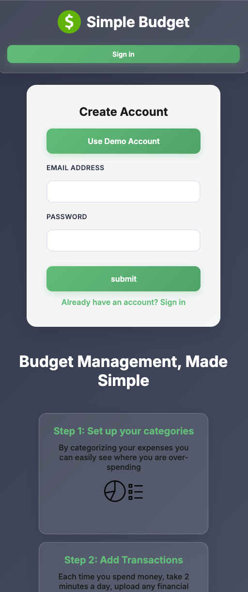
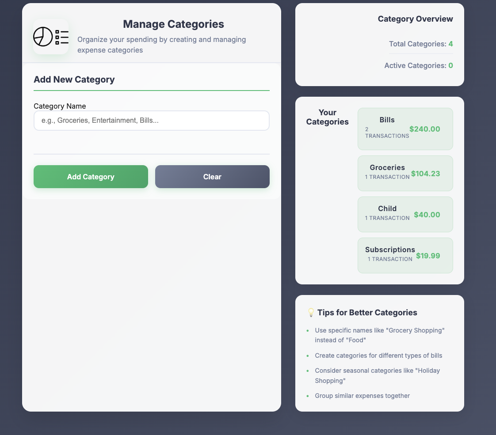
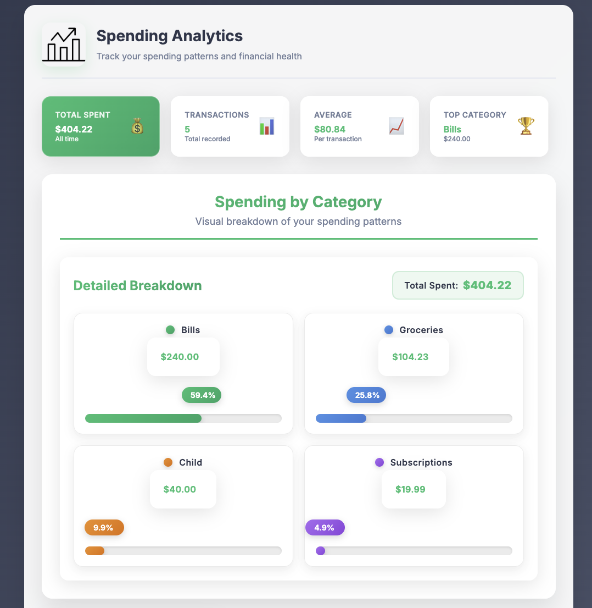

# Simple Budget

A modern, TypeScript-based expense tracking application built with React 18. This app focuses on spending analysis and budget management

## 🚀 Live Demo

The application is deployed and accessible at:

- **GitHub Pages**: [https://garnold.github.io/simple-budget-client-master](https://garnold.github.io/simple-budget-client-master)
- **Railway**: [https://web-production-a960.up.railway.app](https://web-production-a960.up.railway.app)

## 📸 Screenshots

### Mobile Sign-In Interface


_Clean, responsive sign-in interface optimized for mobile devices with glass-morphism design elements._

### Add New Transaction


_Intuitive transaction entry form with category selection and amount input, featuring modern form styling._

### Category Management


_Comprehensive category management interface showing existing categories with transaction counts and spending totals._

### Spending Analytics Dashboard


_Interactive spending breakdown visualization with animated bar charts and percentage pills showing category-wise expense distribution._

## 📱 App Summary

Simple Budget is designed to help you track and analyze your spending patterns. The app simplifies budget management by focusing on expense tracking rather than income management, making it easier to understand where your money goes.

### Key Features

- **🔐 User Authentication** - Secure sign-in with demo account support
- **📊 Category Management** - Create and manage spending categories
- **💰 Transaction Tracking** - Add expenses with category assignments
- **📈 Visual Analytics** - Interactive spending breakdown with animated charts
- **🎨 Modern UI** - Glass-morphism design with smooth animations
- **📱 Responsive Design** - Works seamlessly on desktop and mobile

### Demo Account

- **Email**: `demo@gmail.com`
- **Password**: `password123456`

## 🛠️ Technology Stack

### Core Technologies

- **React 18** - Modern React with hooks and functional components
- **TypeScript 4.9** - Type-safe JavaScript development
- **CSS3** - Custom styling with glass-morphism effects and animations

### Key Dependencies

- **React Router v6** - Client-side routing
- **React Testing Library** - Component testing
- **Jest** - Test runner and assertions
- **Font Awesome** - Icon library
- **React Loader Spinner** - Loading indicators
- **React Promise Tracker** - Promise state management

### Development Tools

- **Create React App** - Build tooling and development server
- **ESLint** - Code linting
- **Prettier** - Code formatting
- **TypeScript** - Static type checking

## 🚀 Getting Started

### Prerequisites

- Node.js (v16 or higher)
- npm or yarn package manager

### Installation

1. **Clone the repository**

   ```bash
   git clone <repository-url>
   cd simple-budget-client-master
   ```

2. **Install dependencies**

   ```bash
   npm install
   ```

3. **Start the development server**

   ```bash
   npm start
   ```

4. **Open your browser**
   Navigate to [http://localhost:3000](http://localhost:3000)

## 📜 Available Scripts

### `npm start`

Runs the app in development mode with hot reloading.

### `npm test`

Launches the test runner in interactive watch mode.

### `npm run build`

Builds the app for production to the `build` folder with optimizations.

### `npm run eject`

**⚠️ One-way operation** - Ejects from Create React App to expose configuration files.

## 🏗️ Project Structure

```
src/
├── AddCategory/          # Category management components
├── AddTransaction/       # Transaction entry components
├── Navigation/           # Navigation components
├── Signin/              # Authentication components
├── SpendingTracker/     # Analytics and visualization
├── App.tsx              # Main application component
├── BudgetContext.tsx    # Global state management
├── config.ts            # Application configuration
├── token-service.ts     # Authentication utilities
└── types.ts             # TypeScript type definitions
```

## 🎨 Design Features

### Modern UI Elements

- **Glass-morphism effects** with backdrop blur
- **Gradient color schemes** for visual hierarchy
- **Smooth animations** and transitions
- **Responsive grid layouts** for optimal viewing
- **Interactive hover effects** and micro-interactions

### Color Palette

- **Primary**: Emerald/Teal gradients (#10B981, #059669, #047857)
- **Accent**: Slate grays for text and backgrounds
- **Interactive**: Hover states and focus indicators

## 🔧 Configuration

### Environment Variables

Create a `.env` file in the root directory:

```env
REACT_APP_API_ENDPOINT=https://web-production-a960.up.railway.app
REACT_APP_API_KEY=your_api_key_here
```

### API Configuration

The app connects to a Railway-hosted API for data persistence. The API endpoint is configured in `src/config.ts`.

## 🧪 Testing

The project includes comprehensive test coverage:

- **Component tests** using React Testing Library
- **User interaction tests** with simulated user events
- **API integration tests** with mocked responses
- **Authentication flow tests** including demo account functionality

Run tests with:

```bash
npm test
```

## 📦 Build and Deployment

### Production Build

```bash
npm run build
```

This creates an optimized production build in the `build` folder.

### Deployment

#### GitHub Pages (Automated CI/CD)

The app is configured for automatic deployment to GitHub Pages using GitHub Actions:

**Setup Instructions:**

1. **Enable GitHub Pages** in repository settings:
   - Go to Settings → Pages
   - Source: "GitHub Actions"
2. **Push to main/master branch** - Automatically triggers deployment
3. **GitHub Actions workflow** - Builds, tests, and deploys the app
4. **Live site** - Available at `https://garnold.github.io/simple-budget-client-master`

**Manual deployment:**

```bash
npm run deploy
```

#### Other Deployment Options

- **Railway**: Configured for Railway deployment

## 🔄 Recent Updates

### Modernization (2024)

- ✅ **Converted to TypeScript** for better type safety
- ✅ **Migrated to React 18** with hooks and functional components
- ✅ **Updated to React Router v6** for modern routing
- ✅ **Enhanced UI/UX** with glass-morphism design
- ✅ **Improved animations** with staggered loading effects
- ✅ **Responsive design** optimization for all screen sizes
- ✅ **Modern testing setup** with updated testing libraries

## 🤝 Contributing

1. Fork the repository
2. Create a feature branch (`git checkout -b feature/amazing-feature`)
3. Commit your changes (`git commit -m 'Add some amazing feature'`)
4. Push to the branch (`git push origin feature/amazing-feature`)
5. Open a Pull Request

## 📄 License

This project is private and proprietary.

## 🆘 Support

For support or questions, please contact the development team or create an issue in the repository.

---

**Built with ❤️ using React, TypeScript, and modern web technologies.**
